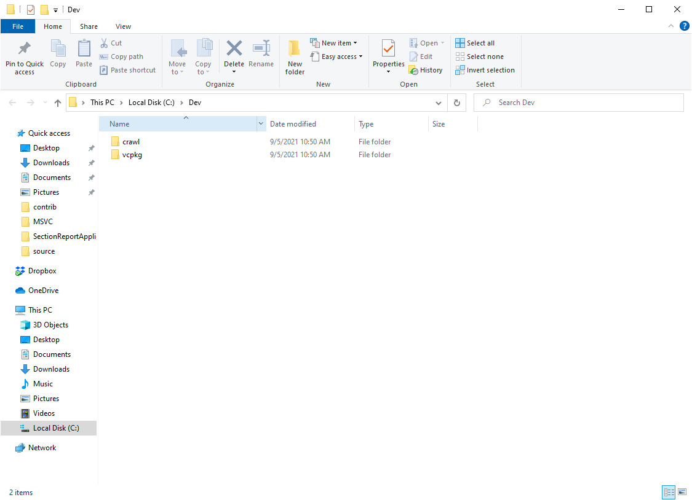

### Overview
This guide describes how to build DCSS in the Visual Studio through the new experimental CMake+vcpkg environment.

### Prerequisites
* [Visual Studio 2019+](https://visualstudio.microsoft.com/ru/vs/)
* [CMake 3.10+](https://cmake.org/)
* [Perl](https://www.perl.org/get.html)
* [Python(https://www.python.org/)
* [vcpkg](https://github.com/microsoft/vcpkg)
  `vcpkg` should be in the same folder as `crawl`. So the folder structure is expected to look like this:
  

### Build Steps
1. In the DCSS source, run `gen-all.cmd` inside `crawl-ref/source/util/`. This
   step must be executed any time you update to a new version of the source (or
   if you have modified tile data or unrandarts).
   
2. Run `vcpkg_install_packages.bat` from `build` folder in order to download required packages.

3. Run either `create_solution_tiles.bat` or `create_solution_console` from `build` depending whether you want to build console or tiles version of the DCSS.

4. Open `build/crawl.sln` in Visual Studio.

5. Build only the project `tilegen` for now. It would generate additional source files.

6. Run `create_solution_tiles.bat`/`create_solution_console.bat` again in order for the new files to be included in the project.

7. Now it should be possible to build and run the project `crawl`.